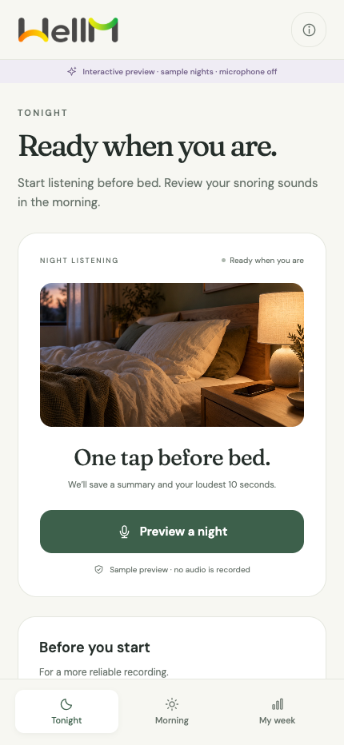
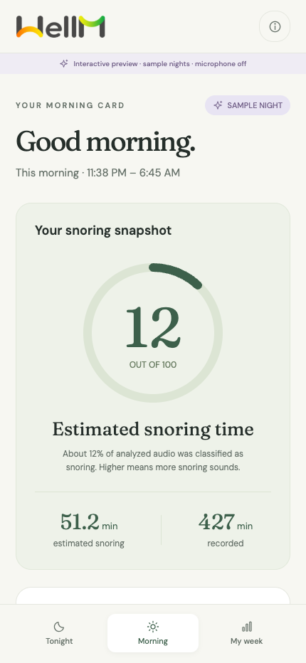
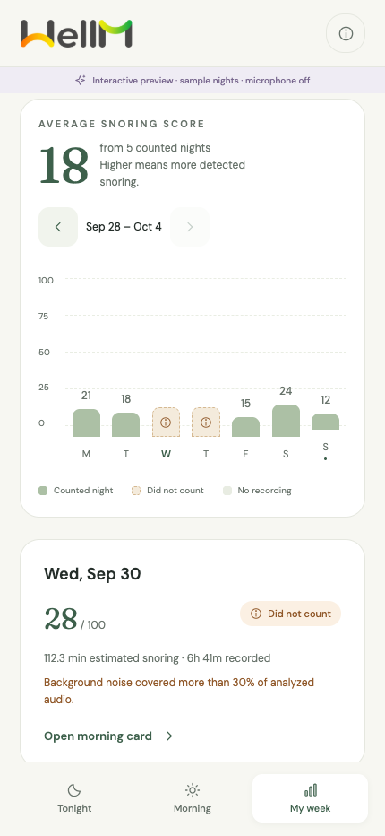

# WellM

A React Native app for the WellM engineering take-home: start a night, review a morning card, and compare a week. It estimates **how much recorded audio sounds like snoring** using a public YAMNet model on the phone. A higher score means more detected snoring. It does not measure sleep quality or diagnose a condition.

The app has no account, backend, or audio upload. Android, iOS, and the browser process microphone audio locally with the bundled YAMNet model. Summaries and the loudest ten seconds are saved on the device. History starts empty; the app does not generate sample nights, scores, or waveforms.

## Preview and download

[Download the Android preview APK](https://github.com/Suraj1812/WellM/releases/tag/v1.0.0-preview) for an arm64 Android phone running Android 7 or newer. This sideloaded preview has an embedded bundle and model; it does not need the development server. Physical-phone recording and background behavior are still awaiting the acceptance run.

| Tonight                                                    | Morning                                                    | My week                                              |
| ---------------------------------------------------------- | ---------------------------------------------------------- | ---------------------------------------------------- |
|  |  |  |

These are cropped browser previews with sample data, not evidence of microphone capture on a phone. See [screenshot details](docs/screenshots/README.md) and [verification results](docs/verification.md).

## Run in a browser or Codex

```sh
npm ci
npm run web
```

Use Node 22.13 or later. `npm run web` prepares the bundled browser model and LiteRT WASM assets before starting Expo. Open the local URL in Codex or a browser, allow microphone access, and tap **Start listening**. The live waveform, analyzed time, snoring estimate, saved clip, and week all come from captured audio. Localhost or HTTPS is required for microphone access.

Keep the browser tab visible while recording. Leaving the tab, closing it, or losing the microphone produces an interrupted recording. Use the native Android/iOS build for overnight recording with the screen locked. Browser recordings are not evidence of native background behavior. Clearing browser site data removes browser recordings.

## Run on a phone

This project uses Expo SDK 57, Expo Router, and a local native Expo module. **Expo Go cannot run the recorder.** Create a native development build; local Android requires an Android build toolchain, and local iOS requires a compatible Xcode installation. Use the [SDK 57 requirements](https://docs.expo.dev/versions/v57.0.0/) and [Expo development build instructions](https://docs.expo.dev/develop/development-builds/introduction/) for your machine.

```sh
npm ci
npm run model:verify
npx expo prebuild
npx expo run:android --device
```

For an iPhone, use `npx expo run:ios --device` instead. Enable the phone's developer mode and connect it to the computer. After changing native code or native configuration, regenerate the native projects with `npx expo prebuild --clean` and rebuild. Native source lives in `modules/wellm-snore`; generated `android/` and `ios/` projects are not the source of truth. See [Expo's native generation guide](https://docs.expo.dev/workflow/continuous-native-generation/).

On the phone, grant microphone access, place it near the bed with its microphone uncovered, and tap **Start listening** on Tonight. The Android foreground notification and iOS audio background mode are intended to keep capture running while the screen is locked. Tap **Stop & see summary** to save the morning card. Keep the app installed to keep its local history; deletion controls remove stored summaries and their audio clips. Up to 90 sessions are retained, with older sessions and their clips pruned.

## Build an APK on GitHub

The [Android preview workflow](.github/workflows/android-preview.yml) can also build a standalone APK on GitHub without an Expo account. Run it from GitHub Actions on `main`; it generates the native project, runs the native clip tests, and verifies the embedded model, bundle, signature, and alignment. The `wellm-android-preview` artifact contains the APK, checksum, verification report, and source revision. Preview builds use the same template signing certificate as the original sideloaded preview.

## Score and counting rules

```text
score = round(100 × detected snoring seconds ÷ analyzed seconds)
```

The score is bounded from 0 to 100 and is zero when no sound could be analyzed. Analysis uses non-overlapping 15,600-sample windows at 16 kHz (0.975 seconds each). A window counts as snoring when YAMNet's Snoring confidence is at least 0.35 and the window is not noisy. Speech, Music, or Television confidence of at least 0.35, or more than 1% clipped PCM samples, marks a window noisy. Noisy windows stay in the denominator and do not add snoring seconds.

A night counts in the week only when it has at least 30 minutes of captured audio, at least 90% analysis coverage, at most 30% noisy analyzed audio, and no recording interruption. Excluded nights remain visible with reasons. Nights are assigned to the local date on which recording stops, so an overnight recording appears on its morning date.

The playback clip is the **loudest ten seconds of captured sound**, chosen by rolling RMS energy. It can contain any sound, including a cough or movement. For a recording shorter than ten seconds, only the available audio is kept. Signal level is dBFS relative to the microphone's digital range, not calibrated room loudness.

## Checks and evidence

```sh
npm run check
npm run model:verify
```

`check` runs TypeScript, lint, tests, and formatting checks. Tests exercise score and quality boundaries, competing sound labels, clipping, interruption, empty analysis, morning assignment, daylight-saving calendar dates, audio resampling, rolling clip selection, and WAV encoding. The [CI workflow](.github/workflows/ci.yml) runs the same checks and verifies the bundled model on pushes and pull requests using Node 22.

**A native implementation is not proof of device behavior.** A real-phone, 30-minute screen-locked run and the required two-minute recording still need to be completed. See [the acceptance protocol](docs/device-testing.md) and record results in [the verification log](docs/verification.md). Native build and microphone behavior must be checked on the target phone before calling the take-home complete.

## Project map

| Path                          | Responsibility                                                       |
| ----------------------------- | -------------------------------------------------------------------- |
| `src/app/`                    | Thin Expo Router routes and navigation                               |
| `src/screens/`                | Tonight, Morning, and Week screen compositions                       |
| `src/components/`             | Shared interface elements and visual tokens                          |
| `src/state/NightProvider.tsx` | Loading real history and session actions                             |
| `src/services/engine.ts`      | Typed native bridge and microphone permissions                       |
| `src/services/engine.web.ts`  | Browser microphone, local LiteRT inference, and IndexedDB history    |
| `src/domain/`                 | Shared types, score policy, dates, and formatting                    |
| `modules/wellm-snore/`        | Android/iOS capture, model inference, local history, clip selection  |
| `tests/`                      | Pure domain behavior tests                                           |
| `docs/`                       | Architecture, device acceptance, and application submission material |
| `assets/`                     | WellM identity assets, generated bedside imagery, and bundled model  |

Read [architecture and tradeoffs](docs/architecture.md) to prepare for explaining the implementation. [The submission draft](docs/submission.md) contains the required five-line score and AI explanations, video outline, and placeholders for your actual Delhi NCR location and notice period.

The supplied WellM logo guides the header wordmark and app icon. A generated bedside photograph supports the Tonight screen. Their origins, generation prompts, and image preparation steps are recorded in [the asset notes](docs/assets.md).

## Model

YAMNet is Google's general sound-event model with 521 classes, including Snoring. The native app bundles a TensorFlow Lite model and performs inference locally. Its general audio training does not establish accuracy for this particular bedroom, phone, or person; thresholds are application choices that need real-world validation. See the [official model description](https://github.com/tensorflow/models/blob/master/research/audioset/yamnet/README.md) and [class map](https://github.com/tensorflow/models/blob/master/research/audioset/yamnet/yamnet_class_map.csv). Model provenance and license details are in [the model assets](assets/models/README.md). `npm run model:verify` verifies the pinned SHA-256 checksum and downloads the public artifact only when needed during setup; recording does not download it.

The interface includes staggered scroll reveals, button feedback, animated Week bars, and a microphone indicator driven by captured signal level, with reduced-motion support. See [motion behavior](docs/motion.md) and [asset prompts and provenance](docs/assets.md).
